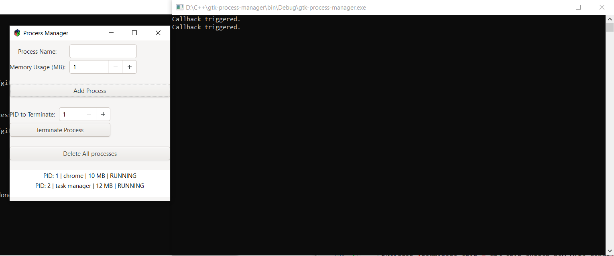

# Process Manager (GTK GUI - C)

This is a simple GTK-based process manager simulation written in C. You can:

- Add a process with name and memory usage
- View all running/terminated processes
- Terminate individual processes
- Delete all processes

## 📸 Screenshot


## Build Instructions
Make sure GTK 3 is installed. Then compile using:

```bash
gcc src/*.c -Iinclude `pkg-config --cflags --libs gtk+-3.0` -o process-manager
